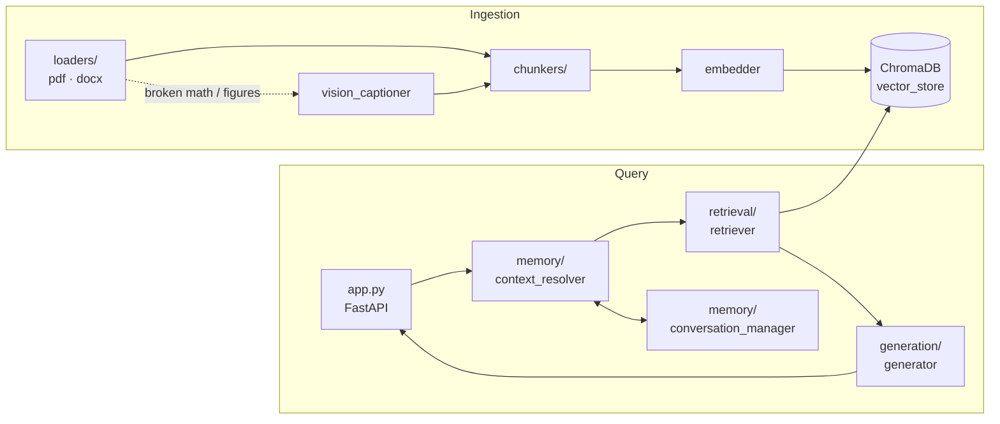

# ⬡ PDFRAG — Retrieval-Augmented Generation System

A production-style RAG system over PDF/DOCX documents. A FastAPI backend (with token
streaming) pairs a ChromaDB vector store with Azure OpenAI (GPT-4.1 + embeddings) and a
vanilla-JS frontend. It features intent-driven retrieval, parallel map-reduce generation,
group-based conversation memory, and a vision fallback that recovers math/diagram content
PDFs fail to extract as text.

---

## Features

**Ingestion**
- PDF & DOCX loading (PyMuPDF)
- Four chunking strategies: recursive, semantic, sliding-window, fixed
- Azure OpenAI embeddings into a persistent ChromaDB store (cosine / HNSW)
- **Vision fallback** — pages whose math/symbols don't extract as text (embedded symbol
  fonts) are re-read by the vision model and transcribed faithfully to text + LaTeX
- **Figure captioning** — diagrams/graphs are detected, described by the vision model, and
  the caption embedded as its own searchable chunk

**Retrieval & generation**
- LLM intent classification (factual / summary / extraction / analysis / comparison /
  positional / ambiguous) — no hardcoded keywords
- Per-intent retrieval modes: `top_k`, `comprehensive`, `exhaustive`
- Parallel map-reduce generation for broad intents over many chunks
- Token streaming via Server-Sent Events
- Per-subject document pinning and compound (multi-operation) query handling

**Conversation memory**
- Group-based multi-turn memory with background summarization
- Dependency resolution (independent / dependent / multi-group / ambiguous)

---

## Project structure

```
PDFRAG-main/
├── run.py                       # Unified launcher (backend + frontend)
├── requirements.txt
├── pyproject.toml
├── .env                         # Azure credentials + config (not committed)
├── backend/
│   ├── app.py                   # FastAPI app + endpoints + SSE streaming
│   ├── pipeline.py              # Composition root: wires the shared singletons
│   ├── config.py                # Env-driven configuration
│   ├── ingestion/               # Load → chunk → embed → store
│   │   ├── document_loader.py
│   │   ├── chunkers/            # recursive, semantic, sliding-window, fixed
│   │   ├── embedder.py          # Azure embeddings (batched, parallel)
│   │   ├── vector_store.py      # ChromaDB wrapper
│   │   ├── vision_captioner.py  # Vision transcription + figure captions
│   │   └── loaders/             # pdf_loader.py, docx_loader.py
│   ├── retrieval/retriever.py   # Intent-driven retrieval modes
│   ├── generation/generator.py  # Single-call + map-reduce + streaming
│   ├── memory/                  # Group-based conversation memory
│   │   ├── storage/             # Persistence (group_memory, memory_store)
│   │   ├── conversation_manager.py  # High-level orchestration
│   │   ├── context_resolver.py      # Query → standalone query + intent
│   │   └── llm_classifier.py        # LLM classification
│   ├── processing/              # Parallel multi-group execution
│   ├── prompts/                 # All LLM prompt text (centralized)
│   ├── summarization/           # Background group summaries
│   └── utils/logger.py
└── frontend/
    ├── index.html  app.js  styles.css
```

---

## Architecture map

A query flows through the layers below; ingestion fills the vector store the
retriever reads from.



**Where to look for what**

| If you want to change… | Go to |
|---|---|
| HTTP routes / SSE streaming | [backend/app.py](backend/app.py) |
| How singletons are wired together | [backend/pipeline.py](backend/pipeline.py) |
| File parsing (PDF/DOCX, math, figures) | [backend/ingestion/loaders/](backend/ingestion/loaders) |
| Chunking strategy | [backend/ingestion/chunkers/](backend/ingestion/chunkers) |
| Vision transcription / captions | [backend/ingestion/vision_captioner.py](backend/ingestion/vision_captioner.py) |
| Retrieval modes (top_k / comprehensive / exhaustive) | [backend/retrieval/retriever.py](backend/retrieval/retriever.py) |
| Answer generation / map-reduce | [backend/generation/generator.py](backend/generation/generator.py) |
| Query classification & resolution | [backend/memory/context_resolver.py](backend/memory/context_resolver.py), [llm_classifier.py](backend/memory/llm_classifier.py) |
| Conversation memory & summaries | [backend/memory/](backend/memory), [backend/summarization/](backend/summarization) |
| Any LLM prompt text | [backend/prompts/](backend/prompts) |
| Config / tunables | [backend/config.py](backend/config.py) |

---

## Requirements

- **Python 3.10+**
- An **Azure OpenAI** resource with:
  - A **chat** deployment (e.g. GPT-4.1, vision-capable)
  - An **embeddings** deployment (e.g. `text-embedding-ada-002`)
- ~500 MB free disk for the virtual environment + ChromaDB data

Python dependencies (from [requirements.txt](requirements.txt)):

```
openai>=1.0.0              chromadb>=0.4.0           httpx>=0.24.0
numpy>=1.24.0             PyMuPDF>=1.24.0           python-docx>=0.8.11
python-dotenv>=1.0.0      langchain>=0.1.0          langchain-core>=0.1.0
langchain-text-splitters>=0.0.1   fastapi>=0.137.0  uvicorn[standard]>=0.49.0
python-multipart>=0.0.32
```

---

## Installation

### 1. Clone the repository

```bash
git clone https://github.com/gangwaritvik/RAG-solution.git
cd PDFRAG-main
```

### 2. Create and activate a virtual environment

**Windows (PowerShell):**
```powershell
python -m venv .venv
.venv\Scripts\Activate.ps1
```

**macOS / Linux:**
```bash
python3 -m venv .venv
source .venv/bin/activate
```

### 3. Install dependencies

```bash
pip install --upgrade pip
pip install -r requirements.txt
```

### 4. Configure credentials

```bash
cp .env.example .env        # Windows: copy .env.example .env
# then edit .env with your Azure keys
```

---

## Configuration (`.env`)

The app **fails fast at startup** with a clear message if any **required** variable is
missing — so you never get a cryptic crash mid-run. Copy [.env.example](.env.example) to
`.env` and fill it in.

| Variable | Required | Default | Description |
|---|:---:|---|---|
| `AZURE_ENDPOINT` | ✅ | — | Azure OpenAI endpoint URL |
| `AZURE_API_KEY` | ✅ | — | Azure OpenAI API key |
| `AZURE_API_VERSION` | ✅ | — | API version, e.g. `2025-01-01-preview` |
| `EMBEDDING_MODEL` | ✅ | — | Embeddings deployment name |
| `CHAT_MODEL` | ✅ | — | Chat deployment name (vision-capable) |
| `CHUNK_SIZE` | ✅ | — | Characters per chunk |
| `CHUNK_OVERLAP` | ✅ | — | Overlap between chunks |
| `TOP_K` | | `5` | Default chunks retrieved per query |
| `EMBEDDING_BATCH_SIZE` | | `50` | Texts per embedding API batch |
| `DOC_RELEVANCE_THRESHOLD` | | `0.25` | Min score to consider a document relevant |
| `CHUNK_RELEVANCE_THRESHOLD` | | `0.20` | Min score to keep a chunk |
| `MAX_UPLOAD_MB` | | `50` | Max size (MB) per uploaded file |
| `SEMANTIC_BREAKPOINT_THRESHOLD` | | `0.3` | Semantic chunker split sensitivity |
| `SEMANTIC_MIN_CHUNK_SIZE` | | `100` | Semantic chunker min chunk size |
| `SEMANTIC_MAX_CHUNK_SIZE` | | `1000` | Semantic chunker max chunk size |
| `VISION_ENABLED` | | `true` | Re-read broken math pages with vision model |
| `VISION_MODEL` | | `CHAT_MODEL` | Vision deployment (defaults to chat model) |
| `VISION_DPI` | | `200` | Render resolution for vision |
| `VISION_MAX_WORKERS` | | `8` | Parallel vision calls per document |
| `VISION_CAPTION_FIGURES` | | `true` | Caption diagrams into searchable chunks |
| `FIGURE_MIN_WIDTH` / `FIGURE_MIN_HEIGHT` | | `60` / `50` | Min figure size (pts) to caption |
| `FIGURE_MAX_PER_PAGE` | | `6` | Max figures captioned per page |

---

## Running

```bash
python run.py              # start backend (8000) + frontend (3030)
python run.py --fresh      # clear vector store & uploads first, then start
python run.py --backend    # backend only
python run.py --frontend   # frontend only
```

- Frontend: http://localhost:3030
- Backend API: http://localhost:8000

`run.py` waits for the backend to finish initializing (uvicorn binds the port only after
all pipeline singletons load) before starting the frontend.

---

## API

| Method | Endpoint | Purpose |
|---|---|---|
| `POST` | `/ingest` | Upload PDF/DOCX (background processing, returns 202) |
| `GET`  | `/status` | Vector count + per-file chunks + ingestion progress |
| `POST` | `/query` | Answer a query (non-streaming) |
| `POST` | `/query/stream` | Answer a query, streamed via SSE |
| `POST` | `/delete` | Delete one file's vectors by filename |
| `POST` | `/clear` | Clear the whole vector store |
| `GET`  | `/groups` | List conversation groups |
| `GET`  | `/group/{id}` `/group/{id}/history` `/group/{id}/summary` | Group context/history/summary |
| `PUT`  | `/group/{id}` | Rename a group |
| `DELETE` | `/group/{id}/turn/{turn_id}` | Delete a turn |

**Example — ingest a file:**
```bash
curl -X POST http://localhost:8000/ingest \
  -F "files=@document.pdf" \
  -F "chunk_mode=recursive"
```

**Example — query:**
```bash
curl -X POST http://localhost:8000/query \
  -H "Content-Type: application/json" \
  -d '{"query": "Summarize the document", "top_k": 5}'
```

---

## How it works

1. **Resolve** — the LLM classifier turns the raw query into a standalone query plus
   `dependency_type`, `retrieval_intent`, `answer_source`, and any document pins.
2. **Retrieve** — the intent selects a retrieval mode: best-N (`top_k`), all-above-threshold
   (`comprehensive`), or the whole document (`exhaustive`).
3. **Generate** — focused intents use a single LLM call; broad intents over many chunks run
   a parallel map-reduce (extract per batch, then merge). Only the answer is streamed;
   a compact memory summary is buffered for conversation memory.
4. **Remember** — each turn is stored in its group; after enough turns a background thread
   summarizes the group for cheap future context.

**Vision fallback (ingestion):** pages with unmappable symbol-font math are rendered to an
image and transcribed to text + LaTeX (replacing the garbled extraction); detected figures
are captioned and embedded as their own chunks. All vision calls for a document run in
parallel.

---

## Tech stack

- **Backend:** Python 3.10+, FastAPI, uvicorn
- **Vector store:** ChromaDB (cosine, HNSW)
- **LLM / embeddings:** Azure OpenAI (GPT-4.1, text-embedding-ada-002)
- **PDF:** PyMuPDF
- **Frontend:** vanilla JavaScript, HTML, CSS, MathJax

---

## Troubleshooting

| Symptom | Cause / Fix |
|---|---|
| `Required environment variable '...' is missing` at startup | A required `.env` value is unset — copy `.env.example` to `.env` and fill it in. |
| `Files locked (backend may still be running)` on `--fresh` | Stop the server (Ctrl+C) before clearing storage; ChromaDB holds the SQLite files. |
| Upload rejected with HTTP 413 | File exceeds `MAX_UPLOAD_MB` — raise the limit in `.env` or split the file. |
| `Backend not ready after 90s` | Heavy first-time init or slow Azure connection; check `backend/logs/` for the real error. |
| Garbled math in answers | Ensure `VISION_ENABLED=true` and that `CHAT_MODEL` is a vision-capable deployment. |
| Empty / no answers | Confirm files finished ingesting via `GET /status`; check relevance thresholds. |

Logs are written to `backend/logs/rag_<timestamp>.log` (also echoed to the console).

---

## Notes for contributors

- **Composition root:** all shared singletons (embedder, vector store, retriever,
  generator, memory manager) are wired once in [backend/pipeline.py](backend/pipeline.py)
  and imported by [backend/app.py](backend/app.py) — never re-instantiate them.
- **Prompts** live in [backend/prompts/](backend/prompts); keep LLM text out of logic code.
- **Config** is centralized in [backend/config.py](backend/config.py) with fail-fast
  validation; add new tunables there, not as inline literals.
- **Runtime data** (`backend/storage/`, `backend/logs/`) is git-ignored and regenerated.
