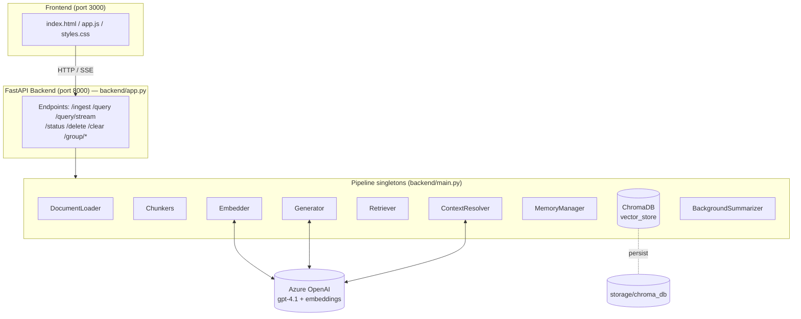
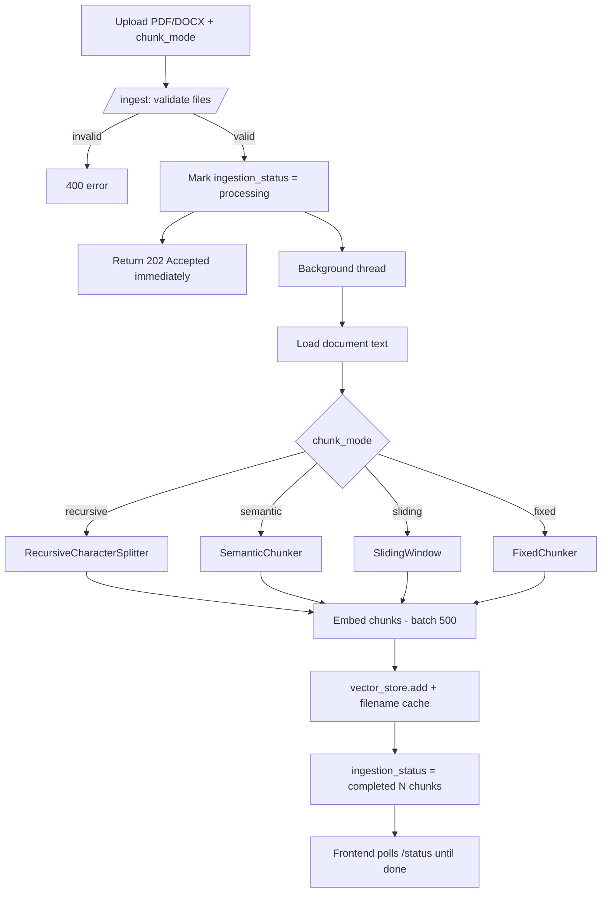
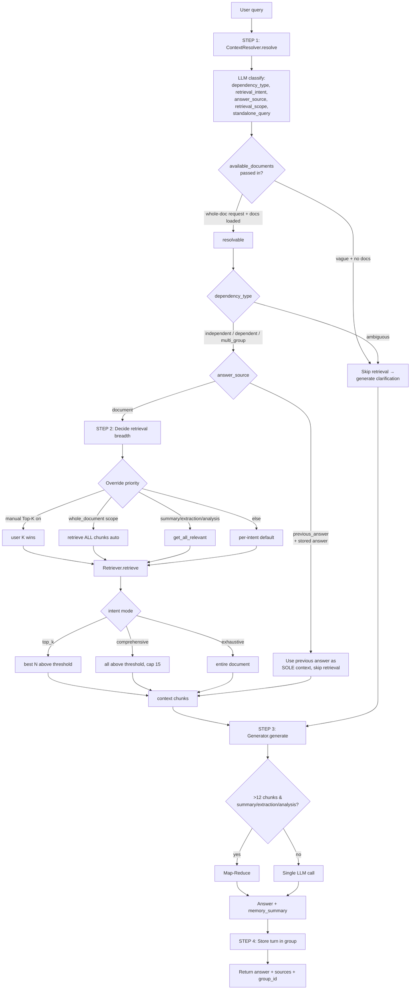
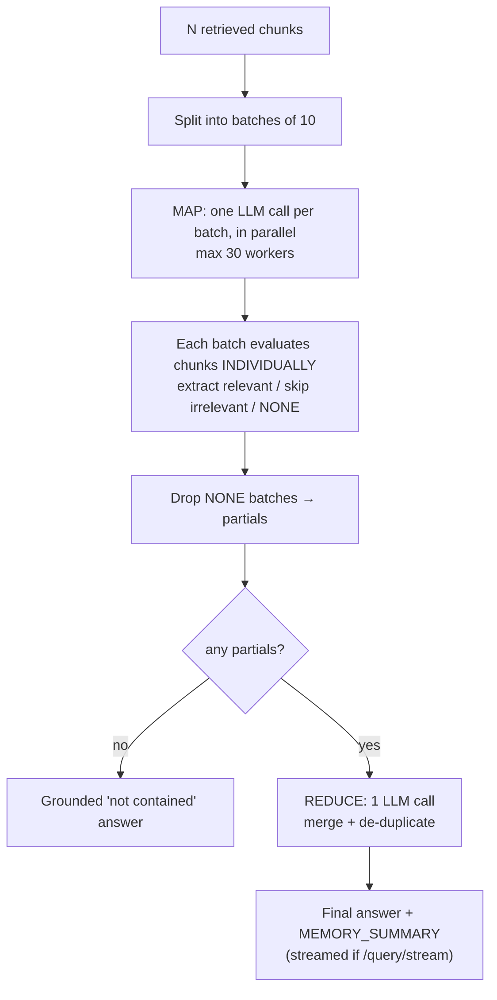
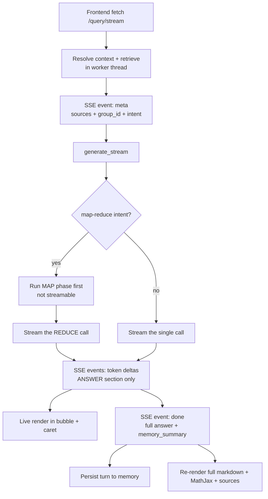
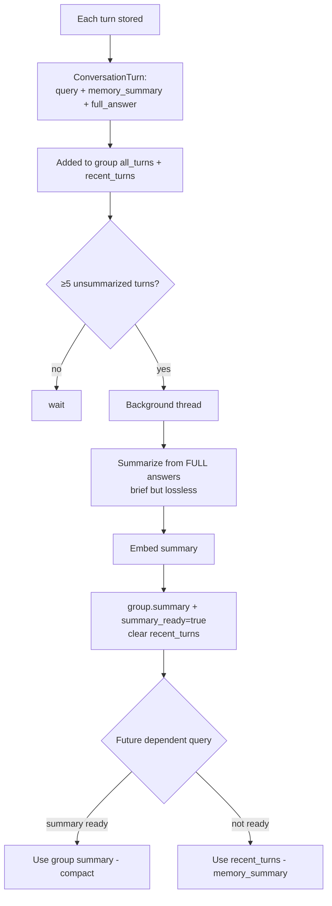

# PDF-RAG — Architecture & Flow

A Retrieval-Augmented Generation system over PDF/DOCX documents. FastAPI backend
(with token streaming) + ChromaDB vector store + Azure OpenAI (gpt-4.1 + embeddings),
served to a vanilla JS frontend.

---

## 1. System Architecture (high level)

---

## 2. Ingestion flow (POST /ingest)

---

## 3. Query flow — the core pipeline (POST /query and /query/stream)

---

## 4. Map-Reduce generation (broad intents)

Used for `summary` / `extraction` / `analysis` when more than 12 chunks are retrieved,
so the whole document is covered without one oversized LLM call.

**LLM calls per generation:** `N batches + 1 reduce` (plus 1 classification call upstream).

---

## 5. Streaming flow (POST /query/stream — Server-Sent Events)

Only the `ANSWER:` section is streamed; the `MEMORY_SUMMARY:` is buffered (never leaked
to the client) and used for conversation memory.

---

## 6. Conversation memory lifecycle

**Two summary tiers:**
- `memory_summary` (per turn, 1–2 lines) — compact; used to show many recent turns cheaply.
- group `summary` (rolling, from full answers) — richer; used as conversational context once ready.

---

## 7. Intent handling matrix

| Intent | Retrieval mode | top_k | threshold | Generation |
|---|---|---|---|---|
| **factual** | top_k | 5 | 0.20 | single call |
| **summary** | comprehensive | 15 | 0.10 | map-reduce (>12 chunks) |
| **analysis** | comprehensive | 15 | 0.10 | map-reduce (>12 chunks), adaptive prompt |
| **comparison** | comprehensive | 15 | 0.12 | single call, comparison table |
| **extraction** | exhaustive | all | 0.0 | map-reduce (>12 chunks), label-fidelity |
| **ambiguous** | (skip) | 3 | 0.20 | clarification request |

**Retrieval modes:**
- `top_k` — best N chunks by similarity above threshold (precise answers).
- `comprehensive` — all chunks above threshold, capped at top_k (synthesis).
- `exhaustive` — entire document, no threshold (enumeration / "list all X").

---

## 8. LLM-driven routing (no hardcoded keywords)

Every routing decision is made by the LLM classifier, not by keyword matching, so it
generalizes across documents and phrasings:

| Field | Decides | Values |
|---|---|---|
| `dependency_type` | conversation relationship | independent / dependent / multi_group / ambiguous |
| `retrieval_intent` | retrieval mode + prompt + map-reduce routing | factual / summary / comparison / extraction / analysis / ambiguous |
| `answer_source` | operate on previous answer vs. retrieve fresh | document / previous_answer |
| `retrieval_scope` | whole document vs. specific topic | whole_document / specific |

**Retrieval breadth precedence** (highest first):
1. Previous-answer follow-up → skip document retrieval, use prior answer as sole context.
2. Manual Top-K toggle ON → user's K wins.
3. Whole-document scope (auto) → retrieve all chunks, no cap.
4. Broad intent default → all relevant chunks above threshold (capped at 15).
5. Otherwise → per-intent default.

---

## Key files

| Area | File |
|---|---|
| FastAPI app + streaming | `PDFRAG-main/backend/app.py` |
| Pipeline singletons + legacy server | `PDFRAG-main/backend/main.py` |
| Classification | `PDFRAG-main/backend/memory/classifiers/llm_classifier.py` |
| Context resolution | `PDFRAG-main/backend/memory/resolution/context_resolver.py` |
| Retrieval modes + intent config | `PDFRAG-main/backend/retrieval/retriever.py` |
| Generation + map-reduce + streaming | `PDFRAG-main/backend/generation/generator.py` |
| All LLM prompts (centralized) | `PDFRAG-main/backend/prompts/` |
| Background group summaries | `PDFRAG-main/backend/summarization/background_summarizer.py` |
| Conversation memory | `PDFRAG-main/backend/memory/management/conversation_manager.py` |
| Frontend | `PDFRAG-main/frontend/{index.html,app.js,styles.css}` |
| Launcher | `run.py` |
